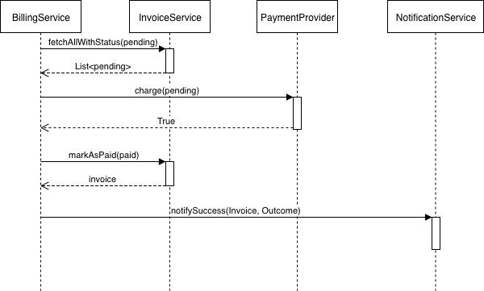
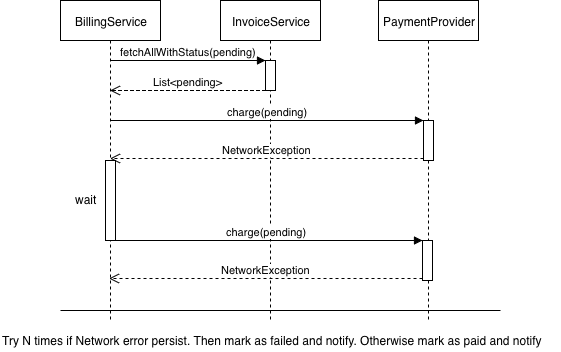

## Antaeus

Antaeus (/ænˈtiːəs/), in Greek mythology, a giant of Libya, the son of the sea god Poseidon and the Earth goddess Gaia. He compelled all strangers who were passing through the country to wrestle with him. Whenever Antaeus touched the Earth (his mother), his strength was renewed, so that even if thrown to the ground, he was invincible. Heracles, in combat with him, discovered the source of his strength and, lifting him up from Earth, crushed him to death.

Welcome to our challenge.

## The solution
This is the documentation about my solution to the Antaeus challenge.
Total time spent: about 12 hours.

## Data Access Layer extension.
The DAL has been extended to fetch the invoices with a specific status (the possible status is `PENDING`, `PAID`, or `FAILED`). This modification has been done in order to exploit the query engine for better performance on objects retrieval.
In order to update an existing invoice, an `update` method has been added to the DAL.

## Service components
Let's define the various components of the Antaeus service.

### Invoice service
The invoice service provides the methods to fetch/modify the invoices.
It has been extended to retrieve the invoices according to some status (e.g., pending), and to update the status of the invoices.

### Customer service
The customer service provides the methods to fetch the customers. No modifications are done.

### Scheduler
The scheduler handles the scheduling of tasks inside the application. It is possible to schedule a periodic task that executes every day of months at a specific time (hours and minutes).

### Notification service
The notification service can send messages to an external system (e.g., a message broker/queue). It can notify the success or failure of a payment request. Currently, it is a mocked service.

### Payment provider
The payment provider is an external service to submit payment requests for invoices. It is a mocked service

### Currency conversion provider
The currency conversion provider is an external service that can convert a value from a currency to a target currency. Currently, it is a mocked service.

### Billing service
The billing service is the core service of Antaeus. It can manage the scheduling of a periodic billing process or explicitly request a payment.

## Services interactions
The payment process can have different outcomes and present different issues, so it is useful to examine the various scenariow. Let's take advantage of some pseudo-use-case diagrams to better understand the interactions between services.

### Payment succeed
The payment simply succeeds - i.e., the payment provider returns `true` as a response.

1. we fetch the pending invoices
2. we request a payment to the payment provider
3. the payment is successful
4. the invoice is marked as paid
5. we send a notification of success using the notification service

### Payment fails
The payment fails - i.e., the payment provider returns `false` as a response.

There is not much we can do. We can mark the invoice as failed and send a notification that will be grabbed by an external service or an operator.
1. we fetch the pending invoices
2. we request a payment to the payment provider
3. the payment fails
4. the invoice is marked as failed
5. we send a notification of failure using the notification service

### Payment succeed - Currency converted
The currency of the invoice does not match the one of the customer.

We try a conversion using the currency conversion provider. If the conversion is done without problems, we try to request another payment. Otherwise, we return a failure outcome.
1. we fetch the pending invoices
2. we request a payment to the payment provider
3. the currency does not match the one of the customer
4. we ask the currency conversion provider to convert the value to the correct currency
5. we try again to request a payment
6. the workflow then depends on the response of the payment provider

### Payment fails - Customer not found
The payment service cannot find the customer. We cannot handle this kind of failure here, so we mark the invoice as failed and notify the problem to an external service or an operator.

1. we fetch the pending invoices
2. we request a payment to the payment provider
3. the payment fails because the customer is not found
4. the invoice is marked as failed
5. we send a notification of failure using the notification service (specifying the cause)

### Payment encounters some network error
The payment provider encounters some network error. We can retry a fixed number of times with a random delay, hoping the network will work correctly.

1. we fetch the pending invoices
2. we request a payment to the payment provider
3. there is some network error
4. we try again to request a payment after a random delay (3-5 seconds)
5. the workflow then depends on the response of the payment provider
6. if the maximum number of retry is reached, return a failure

## Rest API
The rest API has been extended according to the current implementation. Please refer to this [postman collection](https://documenter.getpostman.com/view/4636741/S1Zw9BWS?version=latest) for the documentation.

## Start small, think big: scaling Antaeus
In the current solution, the implementation of some components is missing - like the `CurrencyConversionProvider` and the `NotificationService` that are mocked. However, the implementation has been designed taking into consideration the scaling of the application.
The design is depicted in the following diagram.

The Antaeus service can be scaled to multiple instances for high availability. The periodic billing is scheduled at a random time of the day as a simple way to avoid concurrency between the service instances - assuming that in a more realistic deployment the database is external from the service. The `NotificationService` can be implemented using a Kafka Producer. Exploiting the capabilities of Kafka it is possible to deploy a simple monitoring system, for example capturing the messages using ElasticSearch for indexing and using it as a data source for Grafana. Other services can collect such messages and notify some human operator if required.

## What's missing
Due to (self-imposed) time constraints some things are missing in the current implementation or can be improved:

* The `CurrencyConversionProvider` is just mocked. There are various online services providing free API access for currency conversion that can be queried using a rest call.

* The `NotificationService` is just mocked. It is possible to implement it using a Kafka producer that writes on a specific topic.

* Testing should cover a good part of the implementation. However, a good coverage analysis and a more thorough testing would be required.

* I tried to be as idiomatic as possible writing Kotlin code, but I had zero knowledge of the language, so I'm sure this can be improved greatly.

That's all, enjoy! :rocket:
